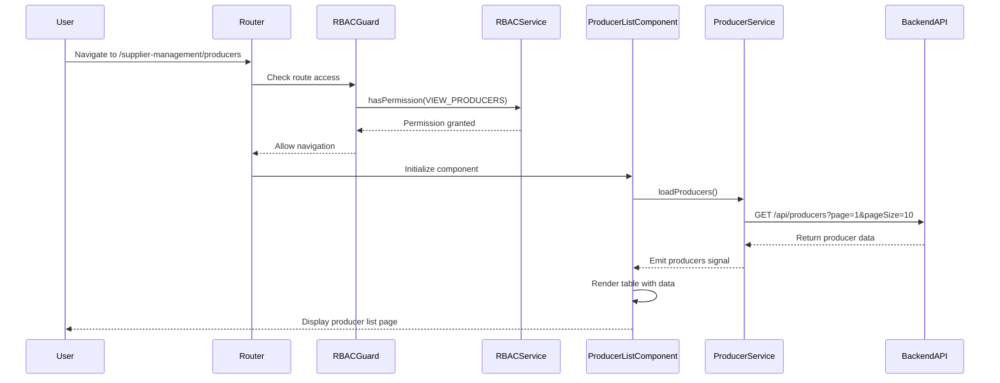
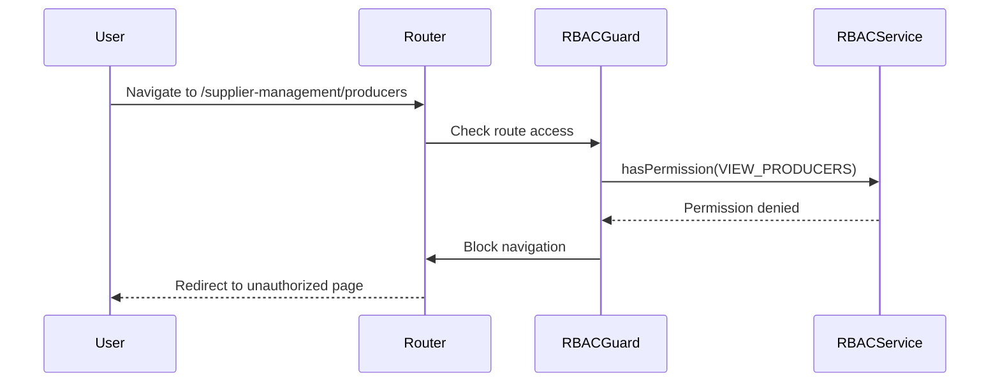

# Sequence Diagram - Page Load Flow

## Flow: Page Load → RBAC Check → Data Render

This diagram illustrates the sequence of events when a user navigates to the Producer List page.



## Description

1. **User Navigation**: User navigates to the Producer List page route
2. **Route Guard**: Router triggers the RBAC guard to check permissions
3. **Permission Check**: Guard queries RBAC service for VIEW_PRODUCERS permission
4. **Authorization**: If permission is granted, navigation proceeds
5. **Component Initialization**: Producer List component is initialized
6. **Data Loading**: Component calls producer service to fetch data
7. **API Request**: Service makes HTTP request to backend API
8. **Data Response**: Backend returns producer data
9. **State Update**: Service updates the producers signal
10. **UI Render**: Component renders the table with the fetched data
11. **User View**: User sees the populated producer list page

## Alternative Flow: Permission Denied

If the user doesn't have the required permission:



## Text-Based Alternative

If Mermaid is not supported, here's a simple text representation:

```
User
  │
  ├─> Navigate to /supplier-management/producers
  │
Router
  │
  ├─> Check route access
  │
RBACGuard
  │
  ├─> hasPermission(VIEW_PRODUCERS)
  │
RBACService
  │
  ├─> Permission granted ──┐
  │                       │
  └───────────────────────┘
                          │
ProducerListComponent     │
  │                       │
  ├─> loadProducers()     │
  │                       │
ProducerService           │
  │                       │
  ├─> GET /api/producers  │
  │                       │
BackendAPI                │
  │                       │
  ├─> Return data ────────┘
  │
  └─> Render table
  │
User
  │
  └─> See producer list
```

